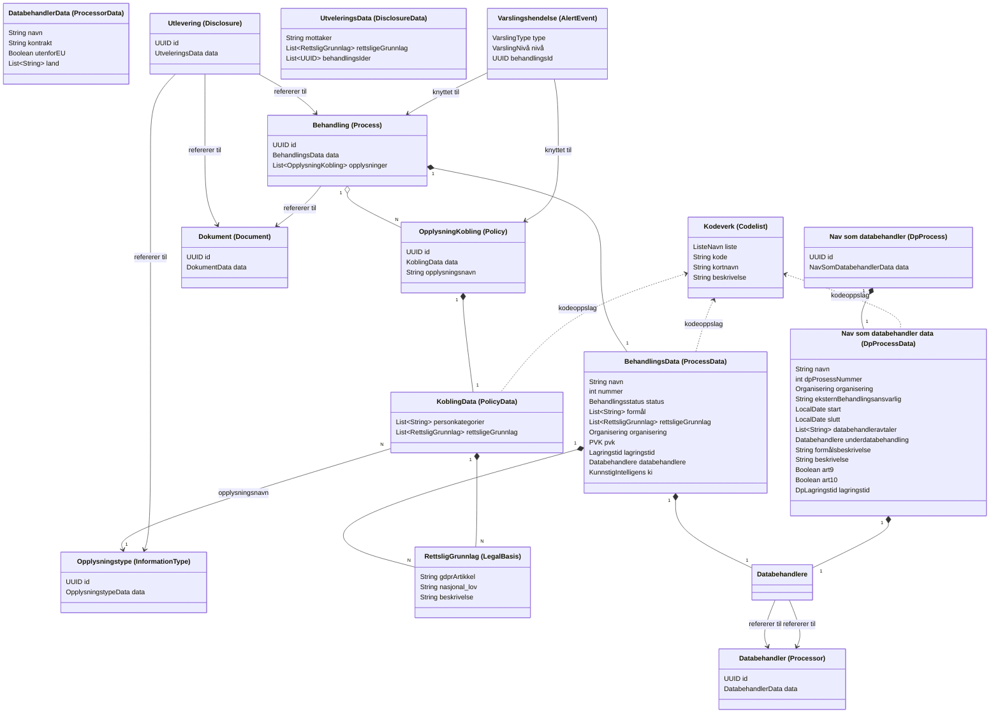
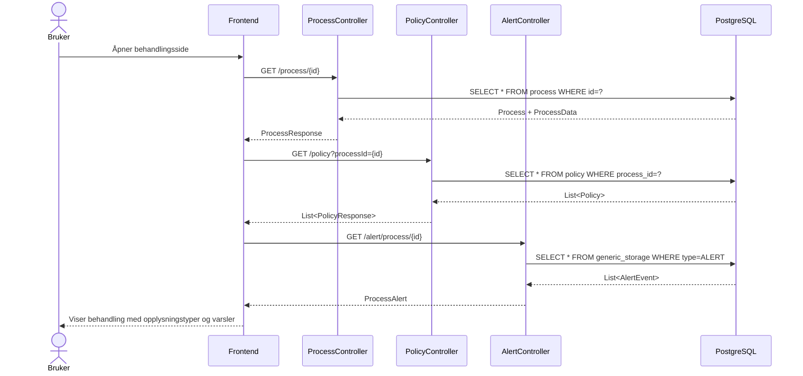
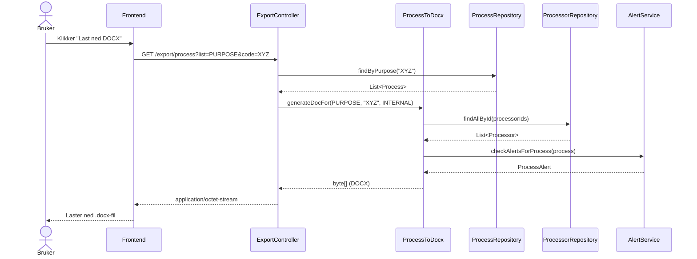
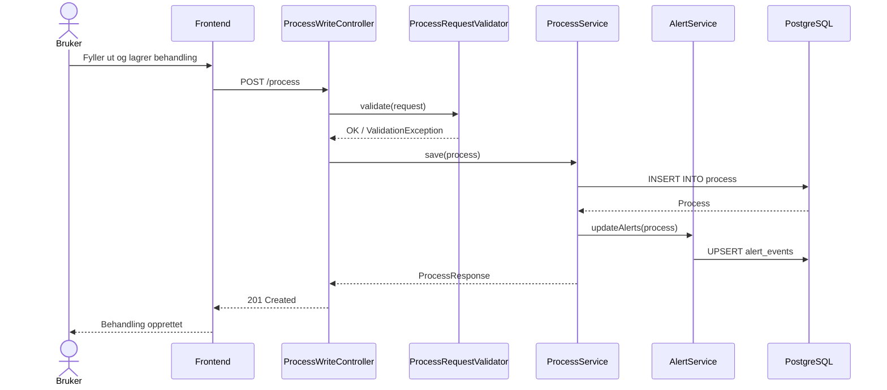
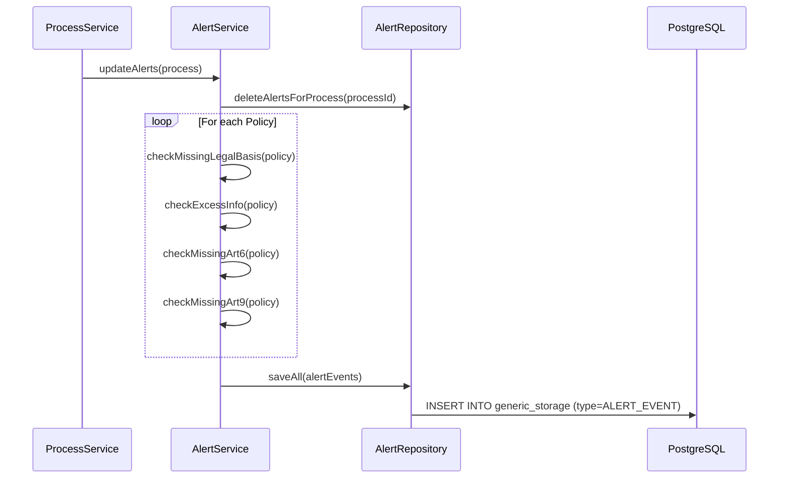
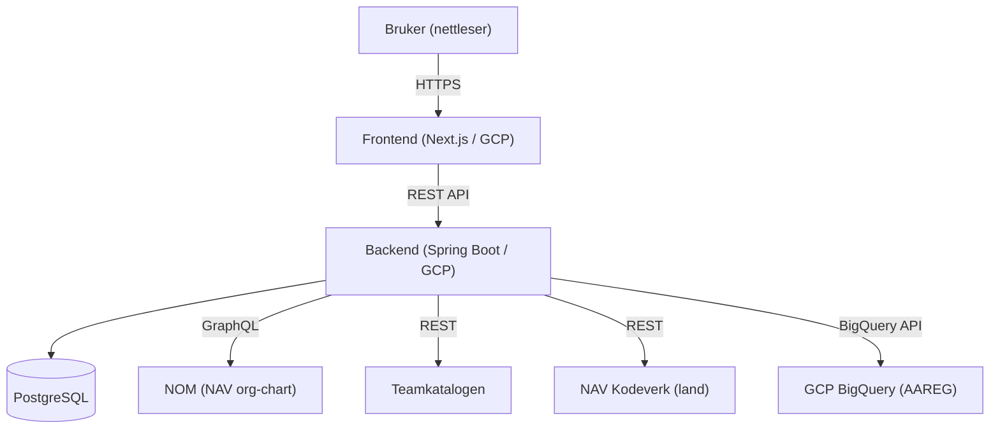

# Polly – Domenemodell

**Sist oppdatert:** 20. april 2026

## Innholdsfortegnelse

- [Slik åpner du filen](#slik-åpner-du-filen)
- [Ordboka (Frontend-navn → Backend-navn)](#ordboka-frontend-navn--backend-navn)
- [Domenemodell](#domenemodell)
- [Sekvensdiagrammer](#sekvensdiagrammer)
  - [1. Laste inn en behandlingsside](#1-laste-inn-en-behandlingsside)
  - [2. Eksportere behandling til DOCX](#2-eksportere-behandling-til-docx)
  - [3. Opprette en behandling (skriveflyt)](#3-opprette-en-behandling-skriveflyt)
  - [4. Varselgenerering (hva skjer bak kulissene)](#4-varselgenerering-hva-skjer-bak-kulissene)
- [Systemarkitektur](#systemarkitektur)

---

## Slik åpner du filen

**Mac (VS Code):**

1. Åpne filen i VS Code.
2. Trykk `Cmd+Shift+X` → søk etter `Markdown Preview Mermaid Support` og installer den.
3. For å forhåndsvise ordboka og mermaid-diagram, trykk `Cmd+Shift+V`.

**Windows (VS Code):**

1. Åpne filen i VS Code
2. Trykk `Ctrl+Shift+X` → søk etter `Markdown Preview Mermaid Support` og installer den.
3. For å forhåndsvise ordboka og mermaid-diagram, trykk `Ctrl+Shift+V`.

---

## Ordboka (Frontend-navn → Backend-navn)

| Frontend (norsk)                    | Backend (engelsk)      |
| ----------------------------------- | ---------------------- |
| Behandling                          | Process                |
| Behandlingsdata                     | ProcessData            |
| Behandlingsstatus                   | ProcessStatus          |
| Behandlingsansvarlig                | DataProcessing         |
| Opplysningstype                     | InformationType        |
| Opplysningstype-kobling             | Policy                 |
| Personkategori                      | SubjectCategory        |
| Rettslig grunnlag                   | LegalBasis             |
| Databehandler                       | Processor              |
| Utlevering                          | Disclosure             |
| Dokument                            | Document               |
| Varslingshendelse                   | AlertEvent             |
| Kodeverk                            | Codelist               |
| Lagringstid                         | Retention              |
| PVK (Personvernkonsekvensvurdering) | Dpia                   |
| Kunstig intelligens                 | AiUsageDescription     |
| Organisering                        | Affiliation            |
| Formål                              | Purpose (via Codelist) |
| Nav som databehandler               | DpProcess              |
| Nav som databehandler data          | DpProcessData          |

---

## Domenemodell

---

## Sekvensdiagrammer

### 1. Laste inn en behandlingsside

---

### 2. Eksportere behandling til DOCX

---

### 3. Opprette en behandling (skriveflyt)

---

### 4. Varselgenerering (hva skjer bak kulissene)

---

## Systemarkitektur

