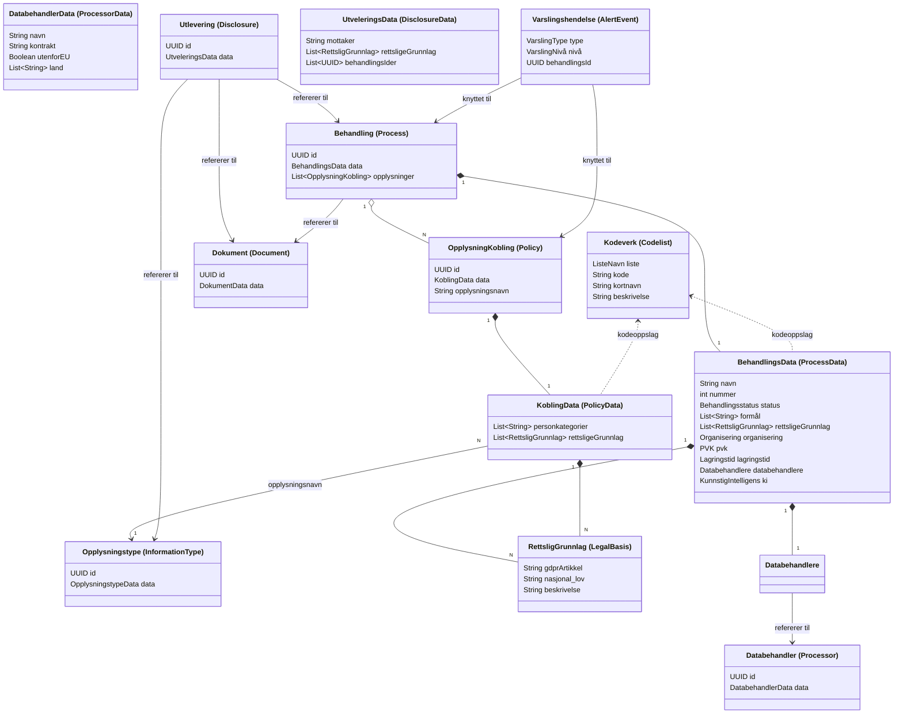

# Polly – Domenemodell

**Opprettet:** 26. mars 2026

## Slik åpner du filen

**Mac (VS Code):**

1. Åpne filen i VS Code
2. Trykk `Cmd+Shift+X` → søk etter `Markdown Preview Mermaid Support` og installer den
3. Trykk `Cmd+Shift+V` for forhåndsvisning, eller `Cmd+K V` for å åpne den ved siden av koden

**Windows (VS Code):**

1. Åpne filen i VS Code
2. Trykk `Ctrl+Shift+X` → søk etter `Markdown Preview Mermaid Support` og installer den
3. Trykk `Ctrl+Shift+V` for forhåndsvisning, eller `Ctrl+K V` for å åpne den ved siden av koden

---

## Ordboka (Frontend-navn → Backend-navn)

| Frontend (norsk)                    | Backend (engelsk)      |
| ----------------------------------- | ---------------------- |
| Behandling                          | Process                |
| Behandlingsdata                     | ProcessData            |
| Behandlingsstatus                   | ProcessStatus          |
| Behandlingsansvarlig                | DataProcessing         |
| Opplysningstype                     | InformationType        |
| Opplysningstype-kobling             | Policy                 |
| Personkategori                      | SubjectCategory        |
| Rettslig grunnlag                   | LegalBasis             |
| Databehandler                       | Processor              |
| Utlevering                          | Disclosure             |
| Dokument                            | Document               |
| Varslingshendelse                   | AlertEvent             |
| Kodeverk                            | Codelist               |
| Lagringstid                         | Retention              |
| PVK (Personvernkonsekvensvurdering) | Dpia                   |
| Kunstig intelligens                 | AiUsageDescription     |
| Organisering                        | Affiliation            |
| Formål                              | Purpose (via Codelist) |

---

## Domenemodell

